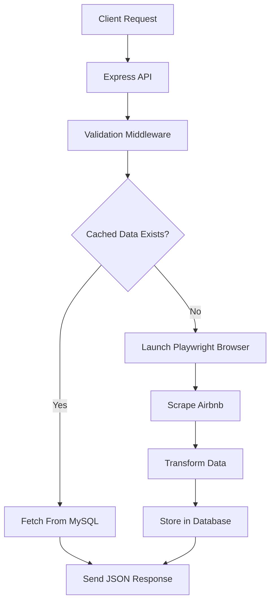
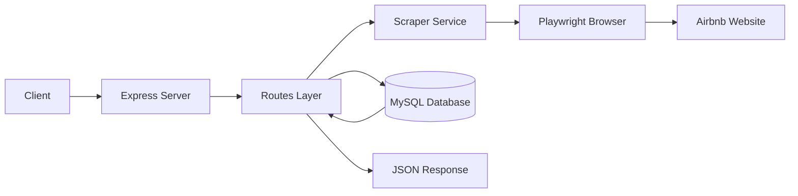
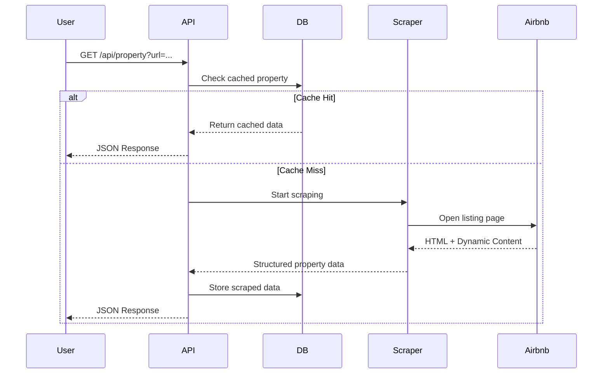

# 🏠 Airbnb Scraper API

<div align="center">


A production-oriented REST API for scraping Airbnb property details and listings using browser automation.

</div>

---

# ✨ Features

- 🔍 Scrape Airbnb property details
- 🏘 Fetch city listings
- 🖼 Extract images, ratings & prices
- ⚡ Playwright-powered browser automation
- 🗄 Optional MySQL caching
- 🧾 Structured logging
- 🛡 Rate limiting & validation
- 📦 RESTful API architecture
- 🧪 Unit testing support
- 🌍 Environment-based configuration

---

# 📸 Preview Workflow

## 🔄 Request Lifecycle



---

# 🧠 System Architecture



---

# 🔁 Sequence Diagram



---

# 🛠 Tech Stack

## Backend

- Node.js
- Express.js

## Browser Automation

- Playwright
- Chromium

## Database

- MySQL

## Utilities

- dotenv
- express-rate-limit
- mysql2

## Development

- Nodemon
- Node Test Runner

---

# 📂 Project Structure

```bash
airbnb-scrapper/
│
├── db/
│   ├── connection.js
│   └── schema.sql
│
├── docs/
│   ├── architecture/
│   ├── api/
│   ├── deployment/
│   ├── guides/
│   └── README.md
│
├── middleware/
│   └── requestLogger.js
│
├── routes/
│   ├── property.js
│   └── listings.js
│
├── scraper/
│   ├── propertyScraper.js
│   └── airbnbScraper.js
│
├── utils/
│   ├── airbnbUrl.js
│   └── logger.js
│
├── test/
│   └── airbnbUrl.test.js
│
├── server.js
├── package.json
├── .env.example
└── README.md
```

---

# 🚀 API Features

## 🏠 Property Scraping

Extracts:

- Property title
- Price
- Rating
- Room ID
- Images
- Property URL

### Endpoint

```http
GET /api/property
```

### Example Request

```bash
curl --get "http://localhost:3000/api/property" \
--data-urlencode "url=https://www.airbnb.co.in/rooms/123456"
```

### Example Response

```json
{
  "source": "scraped",
  "stored": false,
  "data": {
    "room_id": "123456",
    "title": "Luxury Apartment",
    "price": "₹6,848",
    "rating": "5.0",
    "images": [
      "https://image-url.jpg"
    ]
  }
}
```

---

## 🌆 Listings Scraping

Fetch Airbnb listings by city.

### Endpoint

```http
GET /api/listings/:city
```

### Example Request

```bash
curl http://localhost:3000/api/listings/Dehradun
```

### Example Response

```json
[
  {
    "title": "Stay in Dehradun",
    "price": "₹16,138",
    "link": "https://www.airbnb.co.in/rooms/12345"
  }
]
```

---

# ⚙️ Installation

## 1️⃣ Clone Repository

```bash
git clone https://github.com/your-username/airbnb-scrapper.git

cd airbnb-scrapper
```

---

## 2️⃣ Install Dependencies

```bash
npm install
```

---

## 3️⃣ Install Browser

```bash
npm run setup-browser
```

---

# 📝 Environment Variables

Create a `.env` file:

```env
PORT=3000

LOG_LEVEL=info

DB_ENABLED=false

DB_HOST=localhost
DB_USER=root
DB_PASSWORD=password
DB_NAME=airbnb_scraper

AIRBNB_BASE_URL=https://www.airbnb.co.in
```

---

# ▶️ Running Application

## Development

```bash
npm run dev
```

## Production

```bash
npm start
```

---

# 🗄 Database Setup

Create schema:

```bash
mysql -u root -p < db/schema.sql
```

Enable caching:

```env
DB_ENABLED=true
```

---

# 📌 API Endpoints

| Method | Endpoint | Description |
|--------|----------|-------------|
| GET | `/health` | Health Check |
| GET | `/api/property` | Scrape Property |
| GET | `/api/listings/:city` | Scrape Listings |

---

# 🧪 Testing

Run tests:

```bash
npm test
```

Current tests cover:

- URL validation
- Utility functions

---

# 🔒 Security Features

- Rate limiting
- Request correlation IDs
- Input validation
- URL normalization
- Structured logging

---

# 📈 Caching Strategy

The application optionally stores scraped data inside MySQL.

Benefits:

- Faster responses
- Reduced browser execution
- Reduced scraping load
- Lower infrastructure cost

---

# ⚠️ Current Limitations

- No authentication system
- No Redis caching
- No queue system
- No distributed rate limiting
- Airbnb DOM structure dependency
- Browser concurrency not optimized

---

# 🔮 Future Improvements

- JWT Authentication
- Redis Integration
- Queue-based scraping
- Docker support
- Kubernetes deployment
- Browser pooling
- CI/CD pipelines
- Monitoring dashboard
- Webhook support

---

# 📚 Documentation

Detailed docs available inside `/docs`

Includes:

- Architecture
- API Reference
- Deployment Guide
- Security Guide
- Troubleshooting
- Production Notes

---

# 🤝 Contributing

Contributions are welcome.

1. Fork repository
2. Create feature branch
3. Commit changes
4. Push changes
5. Open Pull Request

---

# ⭐ Support

If you found this project useful, give it a ⭐ on GitHub.

---

# 📄 License

Licensed under ISC License.
