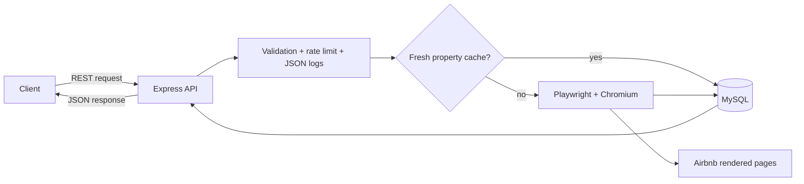

# Airbnb Scraper API

[](https://nodejs.org/)
[](https://expressjs.com/)
[](https://playwright.dev/)
[](https://opensource.org/license/isc-license-txt)

A developer-friendly REST API that extracts visible Airbnb property details and
city search cards through Playwright-powered browser automation. It offers
validated property URLs, optional MySQL caching, structured JSON logs, request
correlation, and clear failure behavior for dynamic third-party pages.

> [!IMPORTANT]
> This project accesses publicly rendered third-party pages through browser
> automation. Before deploying it, confirm that your intended use complies
> with applicable site terms, policies, and laws.

## Why This Exists

Airbnb listings are rendered dynamically, making basic HTML fetching unreliable
for use cases such as property analysis, approved research, testing pipelines,
or demonstration applications. This API wraps that complexity behind simple
JSON endpoints while retaining key pricing context such as dates and guests.

## Features

- Scrape a specific Airbnb room page for title, visible price, rating, and room photos.
- Scrape visible search cards by city.
- Accept regional Airbnb domains such as `airbnb.co.in`.
- Preserve query context that can affect displayed price.
- Cache property results for six hours when MySQL is enabled.
- Operate without MySQL for quick local evaluation.
- Emit structured JSON logs with end-to-end `x-request-id` correlation.
- Throttle API traffic to 10 requests per minute per IP and process.

## Quick Start

### Requirements

- Node.js 20 or later
- npm
- Optional: MySQL 8 or later for persistence and property caching

### Install And Run

```bash
npm install
npm run setup-browser
```

Create local configuration:

```powershell
Copy-Item .env.example .env
```

For a database-free first run, set:

```dotenv
PORT=3000
LOG_LEVEL=info
DB_ENABLED=false
AIRBNB_BASE_URL=https://www.airbnb.co.in
```

Start the API:

```bash
npm start
```

Verify it:

```bash
curl http://localhost:3000/health
```

```json
{
  "status": "ok"
}
```

> [!TIP]
> On Windows PowerShell systems where script execution blocks `npm.ps1`, use
> `npm.cmd start`, `npm.cmd test`, and `npm.cmd run setup-browser`.

## API Examples

### Scrape A Property

Always URL-encode the nested Airbnb URL:

```bash
curl --get "http://localhost:3000/api/property" \
  --data-urlencode "url=https://www.airbnb.co.in/rooms/1588241649003481269?check_in=2026-05-29&check_out=2026-05-31" \
  -H "x-request-id: readme-property-demo"
```

```json
{
  "source": "scraped",
  "stored": false,
  "data": {
    "room_id": "1588241649003481269",
    "property_url": "https://www.airbnb.co.in/rooms/1588241649003481269?check_in=2026-05-29&check_out=2026-05-31",
    "title": "Staycation 2BHK Apartment In Dehradun.",
    "price": "₹6,848",
    "rating": "5.0",
    "images": [
      "https://a0.muscache.com/im/pictures/hosting/Hosting-1588241649003481269/original/example.jpeg"
    ]
  }
}
```

### Scrape City Search Cards

```bash
curl "http://localhost:3000/api/listings/Dehradun"
```

```json
[
  {
    "title": "Place to stay in Dehradun",
    "price": "₹16,138",
    "link": "https://www.airbnb.co.in/rooms/1692751558036902640"
  }
]
```

Live page output changes with availability, stay context, region, and Airbnb
markup. The examples illustrate the response contract rather than guaranteed
current availability or pricing.

## Architecture Preview



| Layer | Responsibility |
| --- | --- |
| Express routes | Input validation, cache coordination, JSON responses |
| Playwright scrapers | Page rendering and visible data extraction |
| MySQL | Optional property cache and listing storage |
| Middleware/utilities | Request IDs, logs, rate limiting, URL normalization |

Read the full [architecture documentation](docs/architecture/overview.md) and
[scraping logic deep dive](docs/architecture/scraping-and-processing.md).

## Configuration

| Variable | Required | Example | Purpose |
| --- | --- | --- | --- |
| `PORT` | No | `3000` | API listener port |
| `LOG_LEVEL` | No | `info` | JSON log threshold: `debug`, `info`, `warn`, `error` |
| `DB_ENABLED` | No | `false` | Explicitly disable MySQL when `false` |
| `DB_HOST` | For MySQL | `localhost` | Database host |
| `DB_USER` | For MySQL | `root` | Database user |
| `DB_PASSWORD` | For MySQL | `secret` | Database password |
| `DB_NAME` | For MySQL | `airbnb_scraper` | Database name |
| `AIRBNB_BASE_URL` | No | `https://www.airbnb.co.in` | Regional host for city searches |

To enable MySQL, initialize the database:

```bash
mysql -u root -p < db/schema.sql
```

Then set `DB_ENABLED=true` and configure the `DB_*` variables.

## Scripts

| Command | Description |
| --- | --- |
| `npm start` | Start the production-style Node process |
| `npm run dev` | Start with `nodemon` reloads during development |
| `npm run setup-browser` | Install the Playwright Chromium runtime |
| `npm test` | Run the Node test suite |

## Documentation

| Guide | Description |
| --- | --- |
| [Documentation home](docs/README.md) | Complete navigation and implementation status |
| [Getting started](docs/guides/getting-started.md) | Full local setup and first requests |
| [Architecture](docs/architecture/overview.md) | System design and sequence diagrams |
| [API reference](docs/api/reference.md) | Parameters, payloads, errors, and edge cases |
| [Database](docs/database/schema.md) | Schema, cache identity, and indexes |
| [Development guide](docs/guides/development.md) | Stack decisions, logging, tests, and conventions |
| [Deployment](docs/deployment/production.md) | Recommended production architecture and CI/CD |
| [Security](docs/security.md) | Threat boundaries and deployment hardening |
| [Troubleshooting](docs/troubleshooting/common-issues.md) | Failure diagnosis and recovery |
| [Production readiness](docs/engineering/production-readiness.md) | Risks and roadmap |
| [Contributing](docs/contributing.md) | Contribution and review workflow |

## Current Limitations

- Authentication and authorization are not implemented.
- Browser scraping occurs synchronously in the HTTP request and is not queued.
- Browser concurrency is not capped.
- Rate limiting is in-memory and therefore single-instance only.
- Airbnb markup or anti-automation behavior can break extraction.
- City listing storage is write-through; city requests do not read cached results.

See [Production readiness](docs/engineering/production-readiness.md) before
exposing the service beyond controlled use.

## Contributing

Contributions should include relevant tests and documentation changes. Start
with the [contributor guide](docs/contributing.md).

## License

Licensed under the ISC License as declared in `package.json`.
