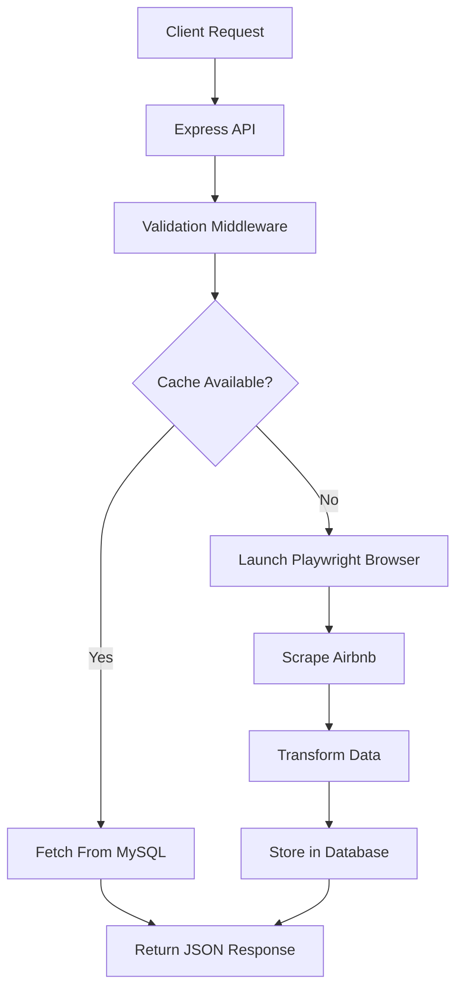
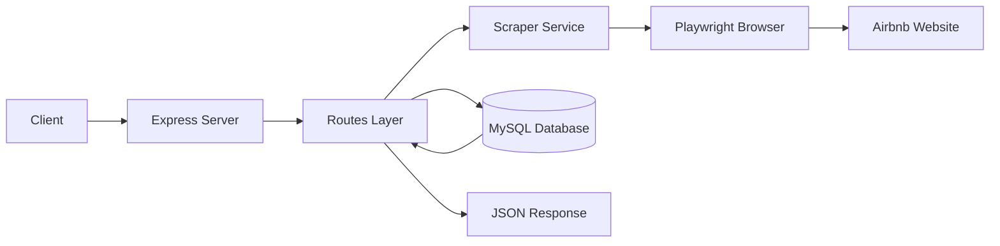
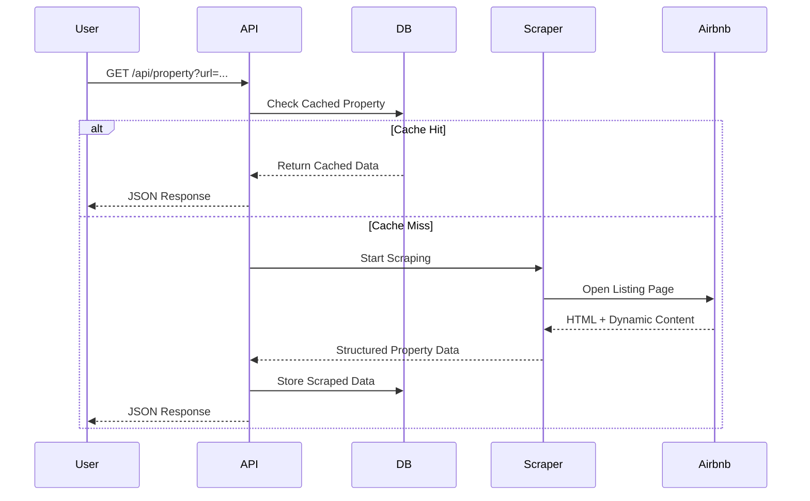

# 🏠 Airbnb Scraper API

<div align="center">


<h3>Production-Oriented Airbnb Scraper API using Node.js, Express, Playwright & MySQL</h3>

Extract Airbnb property details and city listings through browser automation with optional caching, structured logging, and scalable API architecture.

</div>

---

# ✨ Features

- 🔍 Scrape Airbnb property details
- 🏘 Fetch Airbnb listings by city
- 🖼 Extract images, prices & ratings
- ⚡ Playwright-powered browser automation
- 🗄 Optional MySQL caching
- 🧾 Structured logging system
- 🛡 Rate limiting & validation
- 🌍 Environment-based configuration
- 🧪 Unit testing support
- 📦 RESTful API architecture

---

# 📸 Request Workflow



---

# 🧠 System Architecture



---

# 🔁 Sequence Diagram



---

# 🛠 Tech Stack

## Backend

- Node.js
- Express.js

## Browser Automation

- Playwright
- Chromium

## Database

- MySQL

## Utilities

- dotenv
- express-rate-limit
- mysql2

## Development Tools

- Nodemon
- Node Test Runner

---

# 📂 Project Structure

```bash
airbnb-scrapper/
│
├── db/
│   ├── connection.js
│   └── schema.sql
│
├── docs/
│   ├── architecture/
│   ├── api/
│   ├── deployment/
│   ├── guides/
│   └── README.md
│
├── middleware/
│   └── requestLogger.js
│
├── routes/
│   ├── property.js
│   └── listings.js
│
├── scraper/
│   ├── propertyScraper.js
│   └── airbnbScraper.js
│
├── utils/
│   ├── airbnbUrl.js
│   └── logger.js
│
├── test/
│   └── airbnbUrl.test.js
│
├── server.js
├── package.json
├── .env.example
├── LICENSE
└── README.md
```

---

# 🚀 API Features

## 🏠 Property Scraping

Extracts:

- Property title
- Price
- Rating
- Room ID
- Images
- Property URL

### Endpoint

```http
GET /api/property
```

### Example Request

```bash
curl --get "http://localhost:3000/api/property" \
--data-urlencode "url=https://www.airbnb.co.in/rooms/123456"
```

### Example Response

```json
{
  "source": "scraped",
  "stored": false,
  "data": {
    "room_id": "123456",
    "title": "Luxury Apartment",
    "price": "₹6,848",
    "rating": "5.0",
    "images": [
      "https://image-url.jpg"
    ]
  }
}
```

---

## 🌆 Listings Scraping

Fetch Airbnb listings by city.

### Endpoint

```http
GET /api/listings/:city
```

### Example Request

```bash
curl http://localhost:3000/api/listings/Dehradun
```

### Example Response

```json
[
  {
    "title": "Stay in Dehradun",
    "price": "₹16,138",
    "link": "https://www.airbnb.co.in/rooms/12345"
  }
]
```

---

# ⚙️ Installation

## 1️⃣ Clone Repository

```bash
git clone https://github.com/your-username/airbnb-scrapper.git

cd airbnb-scrapper
```

---

## 2️⃣ Install Dependencies

```bash
npm install
```

---

## 3️⃣ Install Playwright Browser

```bash
npm run setup-browser
```

---

# 📝 Environment Variables

Create a `.env` file:

```env
PORT=3000

LOG_LEVEL=info

DB_ENABLED=false

DB_HOST=localhost
DB_USER=root
DB_PASSWORD=password
DB_NAME=airbnb_scraper

AIRBNB_BASE_URL=https://www.airbnb.co.in
```

---

# ▶️ Running the Application

## Development Mode

```bash
npm run dev
```

## Production Mode

```bash
npm start
```

---

# 🗄 Database Setup

Create the schema:

```bash
mysql -u root -p < db/schema.sql
```

Enable database caching:

```env
DB_ENABLED=true
```

---

# 📌 API Endpoints

| Method | Endpoint | Description |
|--------|----------|-------------|
| GET | `/health` | Health Check |
| GET | `/api/property` | Scrape Property Details |
| GET | `/api/listings/:city` | Scrape Listings by City |

---

# 🧪 Running Tests

```bash
npm test
```

Current test coverage includes:

- Airbnb URL validation
- Utility layer testing

---

# 🔒 Security Features

- Rate limiting
- Request correlation IDs
- Input validation
- URL normalization
- Structured logging

---

# 📈 Caching Strategy

Property results can optionally be stored inside MySQL.

### Benefits

- Faster response times
- Reduced browser execution
- Reduced scraping overhead
- Lower infrastructure cost

---

# ⚠️ Current Limitations

- No authentication system
- No Redis caching
- No queue-based scraping
- No distributed rate limiting
- Browser concurrency not optimized
- Dependent on Airbnb DOM structure

---

# 🔮 Future Improvements

- JWT Authentication
- Redis Integration
- Queue-based scraping
- Docker support
- Kubernetes deployment
- Browser pooling
- CI/CD pipelines
- Monitoring dashboard
- Webhook support

---

# 📚 Documentation

Detailed documentation available inside `/docs`

Includes:

- Architecture
- API Reference
- Deployment Guide
- Security Guide
- Troubleshooting
- Production Notes

---

# 🤝 Contributing

Contributions are welcome.

### Steps

1. Fork repository
2. Create feature branch
3. Commit changes
4. Push changes
5. Open Pull Request

---

# ⭐ Support

If you found this project useful, consider giving it a ⭐ on GitHub.

---

# 📄 License

This project is licensed under the MIT License.

Copyright (c) 2026 Kuldeep Chaudhary

Permission is hereby granted, free of charge, to any person obtaining a copy
of this software and associated documentation files (the "Software"), to deal
in the Software without restriction, including without limitation the rights
to use, copy, modify, merge, publish, distribute, sublicense, and/or sell
copies of the Software, and to permit persons to whom the Software is
furnished to do so, subject to the following conditions:

The above copyright notice and this permission notice shall be included in all
copies or substantial portions of the Software.

THE SOFTWARE IS PROVIDED "AS IS", WITHOUT WARRANTY OF ANY KIND, EXPRESS OR
IMPLIED, INCLUDING BUT NOT LIMITED TO THE WARRANTIES OF MERCHANTABILITY,
FITNESS FOR A PARTICULAR PURPOSE AND NONINFRINGEMENT. IN NO EVENT SHALL THE
AUTHORS OR COPYRIGHT HOLDERS BE LIABLE FOR ANY CLAIM, DAMAGES OR OTHER
LIABILITY, WHETHER IN AN ACTION OF CONTRACT, TORT OR OTHERWISE, ARISING FROM,
OUT OF OR IN CONNECTION WITH THE SOFTWARE OR THE USE OR OTHER DEALINGS IN THE
SOFTWARE.
